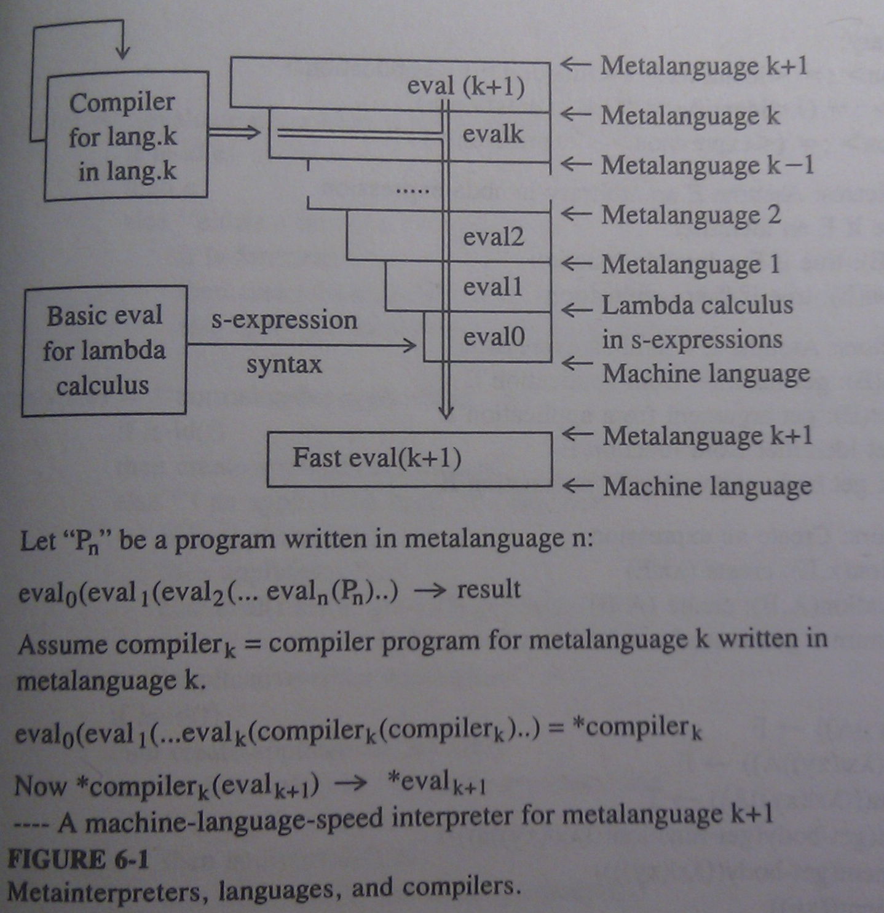
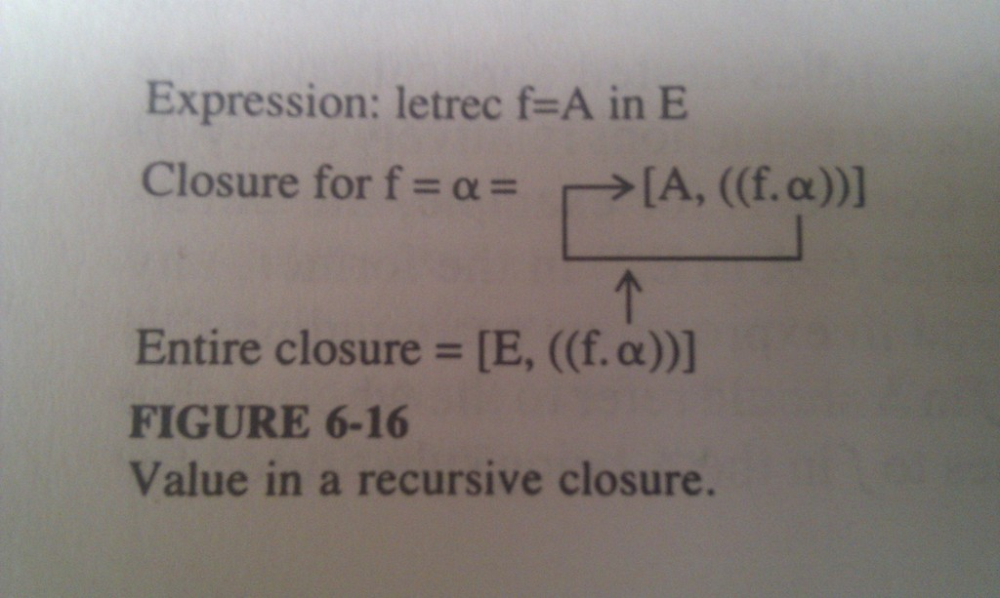

# Self - Interpretation #

&lambda; - Calculus is powerful enough to express any computable function. In
this chapter we will show, that &lambda; - Calculus is expressible as
a computable function. It is therefore possible to write an interpreter for
&lambda; - Calculus in &lambda; - Calculus.

We will write a function called ***eval***, that takes arbitrary &lambda; function
and evaluates it. Once having this ***eval*** function writen in machine
language, we can use it to write a more advanced ***eval*** on top of it, which
has more advanced features (abstract programming syntax, builtin functions, IO,
error handling etc). We can then continue and use new ***eval*** to build more
**evals** for even more powerful features. This way we can quickly implement
experimental langauges, and if the performance needs to be improved, a layer
can be reimplemented in native language. Layers above will execute faster
without the need to reimplement them.

## Abstract Interpreters ##

First interpreter interprets simple &lambda; - Calculus without any of the
*simplifications*.

syntax summary:

	<expression> := <identifier> | <function> | <application>
	<function>   := (-><identifier>'|'<expression)
	<application := (<expression><expression)

Abstract syntax functions for ***eval***:

	is-id(E)
	is-function(E)
	is-application(E)

	get-function(E)			#get function from application E
	get-argument(E)  		#get argument from application E
	get-id(E)        		#get identifier from function E
	get-body(E)      		#get body from function E

	create-function(x,E)    #create (->x|E)
	create-application(A,E) #create (AB)
	new-id()				#return a guaranteed unique identifier symbol

Abstract interpreter:

	eval(e) =				#evaluate expression e as far as we can
		if is-id(e)
		then e
		else if is-function(e) 
			 then create-function(get-id(e), eval(get-body(e)))
			 else apply(get-function(e), get-argument(e))

	apply(f,a) =			#normal order application
		if is-id(f)
		then create-application(f, eval(a))
		else if is-application(f)
			 then apply(eval(f),a)
			 else eval(subs(a, get-id(f),get-body(f)))

	apply(f,a) =			#applicative order application
		if is-id(f)
		then create-application(f, eval(a))
		else let b = eval(a) in 
				if is-application(f)
				then apply(eval(f),a)
				else eval(subs(a, get-id(f),get-body(f)))

	subs(a,x,e) =			#substitute a for x in e
		if is-id(e)
		then if e = x 
			 then a
			 else e
		else if is-application(e)
			 then create-application(subs(a,x,get-function(e)),
									 subs(a,x,get-argument))
			 else let y = get-id(e)
				  and c = get-body(e)
				  in if y = x
					 then e
					 else let z = new-id() in
							create-function(z, subs(a,x,subs(z,y,c)))

And now in human language. ***Eval*** has 3 sections, in first it leaves identifiers as
they are, in second it handles functions by by recreating them, but with their
body fully reduced. In third, it handles application by applying the function
to arguments (therefore passing it into ***apply*** function)

***Apply*** handles reduction of applications. If `f` is identifier, the only
thing that can be reduced is the argument. If `f` is application, then the
function needs to be evaluated before applied to arguments. If  `f` is
function, it is applied to the argument `a`. There are two versions of
***apply***, one for normal order evaluation, one for applicative order
evaluation. In the second, arguments are evaluated before evaluating function
and before applying the function on arguments.  
*Note: If `f` is an application in form `(xy)`, then the __eval__ will be caught in
an infinite loop. Fix is left as an exercise for the reader.*

***Subs*** function performs the substitution process. For simplicity, the
function always renames `y`, even when not necessary. Improving this is left as
an exercise for the reader.

## Lambda Expressions as S-Expressions ##

	<identifier> => <identifier>
	(<->identifier>|<l-expr>) => (lambda (<identifier>) <s-expr>)
	(<l-expr><l-expr>) => (<s-expr> <s-expr>)

Example:

	(((->x|(->y|x))a)b) => (((lambda (x) (lambda (y) x)) a) b)

Converted ***subs*** function:

	subs(a,x,e) =
		if atom(e)
		then if eq(e,x)
			 then a
			 else e
		else if not(is-function(e))
			 then list(subs(a,x,car(e)), subs(a,x,cadr(e)))
			 else let y = caadr(e)
				  and c = caddr(e)
				  in if y = x
					 then e
					 else let z = new-id()
						  in list(lambda, list(z), subs(a,x,subs(zyc)))
						  

Multiple arguments:

	(->xy|y(xx))wz => ((lambda (x y) (y (x x))) w z)

Literal booleans, numbers and strings represent ***Constants***.

Common functions, such as `+, -, *, and, or, car, cdr, const`, are called
***built-in functions*** and ***eval*** or ***apply*** must be modified to
include tests for and code to perform there functions.

Similarly to `lambda` we can add other convenient notations from abstract
programming such as `let-in`, `letrec-in`, `if-then-else` etc. These are called
***special forms***. ***Special forms*** are not functions, it depends on
***eval*** how they will be handled. For example `if-then-else` if condition
is truthy, then the *then* expression will be passed into the ***eval***, if
not, te *else* expression will. Other example is `quote` special form, which
will cause that its arguments will not be evaluated at all.

## An Expanded Interpreter ##

* Interpreted language is in S-Expression format
* Functions may have multiple arguments
* Support for built-in functions such as `+`, `car` ...
* A mix of normal (default) and applicative (for built-in functions etc) order reduction
* Support for special forms such as `let, letrec, if, cond` ...  

Code:

	eval(e) =
		if atom(e)
		then e
		else let fcn = car(e)
			 and args = cdr(e)
			 in if atom(fcn)
			    then if fcn = quote then car(args)
				elseif member(fcn, builtins)
				then apply-builtin(fcn, args)
				elseif fcm = lambda
				then list(lambda, car(args), eval(cadr(args)))
				elseif fcn = if
				then if eval(car(args)) = T
					 then eval(cadr(args))
					 else eval(caddr(args))
				elseif fcn = cond then eval-cond(args)
				elseif (fcn = let) or (fcn = letrec)
				then let ids = car(args)
					 and vals = cadr(args)
					 and body = caddr(args)
					 in if fcn = let
					    then subs2(vals, ids, body)
						else #letrec supports only one definition at the moment
							apply(list(lambda, ids, body),
								  list(Y, list(lambda, ids, vals))
							where y = (lambda (y) ((lambda (x) (y (x x)))
							  					   (lambda (x) (y (x x)))))
				else apply(fcn, args)
			else apply(fcn, args)

	apply(f,a) = #normal order evaluation
		if atom(f)
		then cons(f, map(eval, a))
		elseif car(f) = lambda
		then let normal = length(cadr(f))
			 and actual = length(a)
			 in if formal = actual
				then eval(subs2(a, cadr(f), caddr(f))
				else list(lambda,
						  drop(actual, cadr(f)),
						  eval(subs2(a, cadr(f), caddr(f))))
					 whererec drop(count, x) = 
								  if count = 0
								  then x
								  else drop(count - 1, cdr(x))
		else apply(f, a)

	apply-builtin(f, a) = 
		let args = map(eval(a))
		in if f = car
		   then caar(args)
		   elseif f = cdr
		   then cdar(args)
		   elseif f = +
		   then car(args) + cadr(args)
		   elseif ...

	eval-cond(a) = 
		if null(a) 
		then nil
		else let z = car(a) 
			 in if eval(car(z)) = T
			 then eval(cadr(z))
			 else eval-cond(cdr(z))

	subs2(v,n,e) = #handles multiple arguments
		if atom(e)
		then lookup(e,n,v)
		elseif car(e) = lambda
		then let old = cadr(e) 
		     in let new = map(new-id, old)
			    in list(lambda, new, subs2(v,n,subs2(new,old,caddr(e))))
		else map((->z|subs2(v,n,z)),e)

	lookup(z,n,v) = #find z in n and replace by value in v
		if null(n) or null(v)
		then z
		elseif car(n) = z then car(v)
		else lookup(z,cdr(n),cdr(v))
      
    
This approach suffers from an inefficiency - more passes may be needed (up to
two per argument, once to find all free occurences and once to do the
substitutions. One alternative is simply to remember at the time of an
application which identifiers are to get which values, and then do the
substitution on an identifier by identifier basis when the function's body is
scanned for the next application. These records will be stored in
***association list***, which is created at the time of application. We've
saved some work, but we still have to rename inner function's binding
variables. Solution will come, but remember the source of the problem because
it will pop up later as the ***funarg problem***.

## Closures ##

Most of the problems with renaming come from trying to improve the *efficiency*
of a basic interpreter through a combination of applicative order reduction and
the use of simple association lists in place of immediate substitutions.
A better solution involves *packaging* an expression with its environment into
a single unit, which can be passed around, but still unpackaged and evaluated
when needed. Such a package is called ***closure***. 

Consider an application `(->x|E)A` (or the equivalent `let x=A in E`). Assuming
for the time being that `A` has no free identifiers, let us suspend this
evaluation just before the substitution takes place. We have an expression `E`
and the ***environment*** `x=A` (or alist `((x.A))`). This combination is
called ***closure***. 

	<closure> := [<expression>,<environment>]

Basic closure eval:

	eval(e, alist) =
		if is-identifier(e)
		then let z = assoc(e, alist)
			 in if null(z) then e else cdr(z)
		elseif is-closure(e)
		then let e1 = get-expression(e)
			 and alist1 = get-environment(e)
			 in eval(eval(e1, alist1),alis)
		else ...

	apply(f, a) =
		...
		elseif is-function(f)
		then create-closure(get-body(f),
							create-alist(get-identifier(f), a))
		else ...

Example:
	
	let x = 3 and y = 2 in let x = x + y in x * y
	= eval([[x * y, ((x.x + y))], ((x.3)(y.2))], nil)
	= eval(eval([x * y, ((x.x + y))], ((x.3)(y.2))),nil)
	= eval(eval(eval(x * y, ((x.x + y))), ((x.3)(y.2))),nil)
	= eval(eval((x + y) * y, ((x.3)(y.2))),nil)
	= eval((3 + 2) * 2, nil)
	= 10

***Closure*** is ***referentially transparent***, its value is the same
whenever and wherever it is evaluated.

## Recursive Closures ##

Above implementation handles nested applications, free variables, normal and
applicative order reductions, but it does not handle recursion. Consider for
example the differences between `let f = A in E` and `letrec f = A in E`. In
the former, any free instances of `f` in `A` refer to `f`'s bound in
expressions surrounding this one. In the latter, any free instances of `f` in
`A` should refer to the whole value of `A` as is. Even worse, those references
to `f` in the `A` being substituted for `f` in `A` must also be replaced, as
must the references to `f` in that replacement. This will go forever.

What we want is:

	[A/f]E = [([a/F]A)/F]E = [([([...)/f]A)f]A)/f]E

By using a closure to handle this is that it can delay any required
substitution until they are absolutely needed, and then perform only a minimal
amount of substitution necessary to satisfy the immediate evaluation. 

The problem with expressing this as a closure is getting an alist entry which
has some sort of internal references to itself. We want a closure of the form
`[E, ((f.'value for f'))]`. If we let a stand for the 'value for f', then

	a = [A, ((f.a))]

If we implement such data structures as s-expressions, we find that the
***cdr***s of cells containing such contexts point back to the ***car***s of
that cell or some earlier cell linked to it. This will be discussed in more
detail for the SECD Machine.

Exercises:

1. Modify subs to rename variables only when necessary.
2. Assume following syntax for certain class of s-expressions:

        <logic-expr> := <id> | T | F
        			| (and <logic-expr> <logic-expr>)
        			| (or <logic-expr> <logic-expr)
        			| (not <logic-expr>)
        			| (let <id> <logic-expr> <logic-expr>)

  Define in abstract syntaqx a function that will evaluate such expressions,
  assuming it is given as input an association list of all identifiers and their
  current values. Show that it works for the expression:
	
		(let x F (let y T (and (not x) (or x y))))

3. Modify closure evaluator to handle an extension to `cond` suchthat if the
   last element of `cond` list has only one expression in it, and no prior
   test passes, the value of this expression is returned.  
   
		(cond ((= 1 2) F) ((> 4 5) F) ((+ 1 2))) 

	would return 3.

