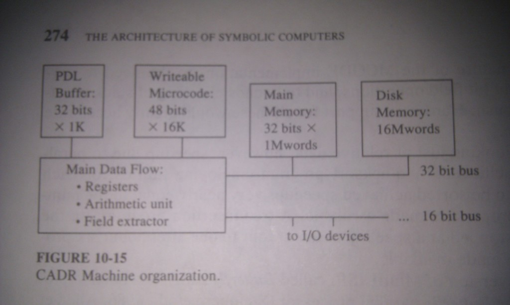
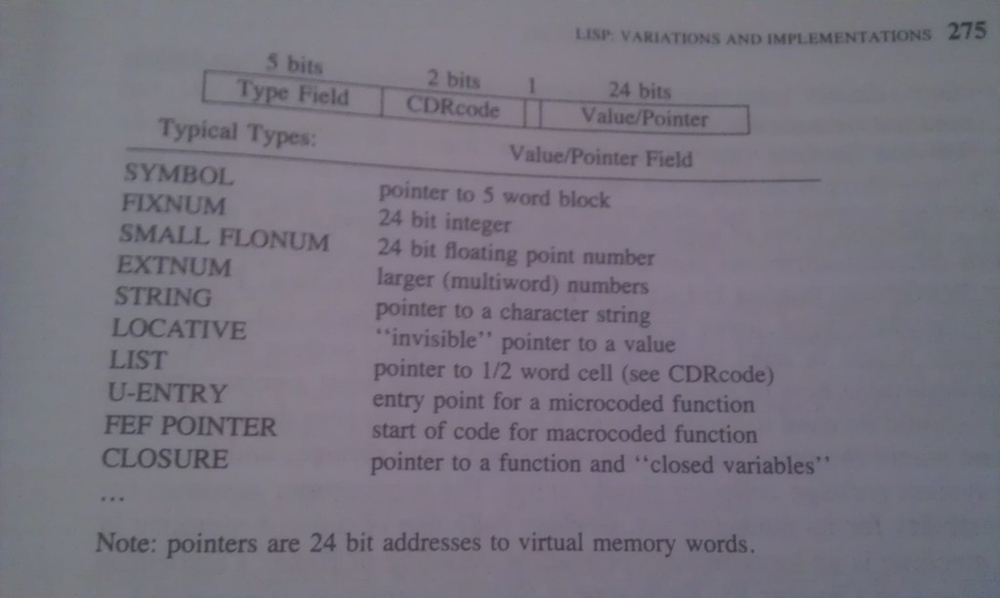
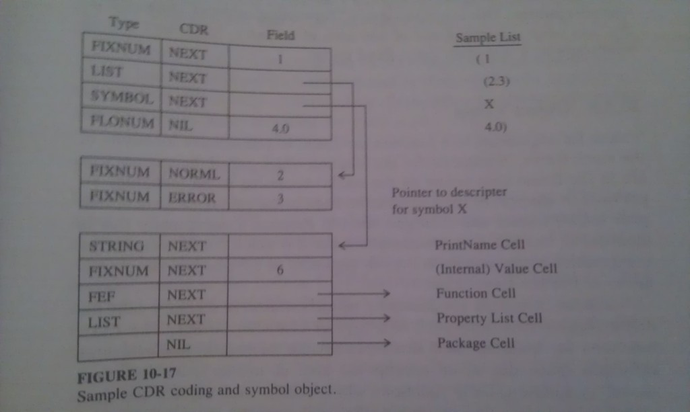
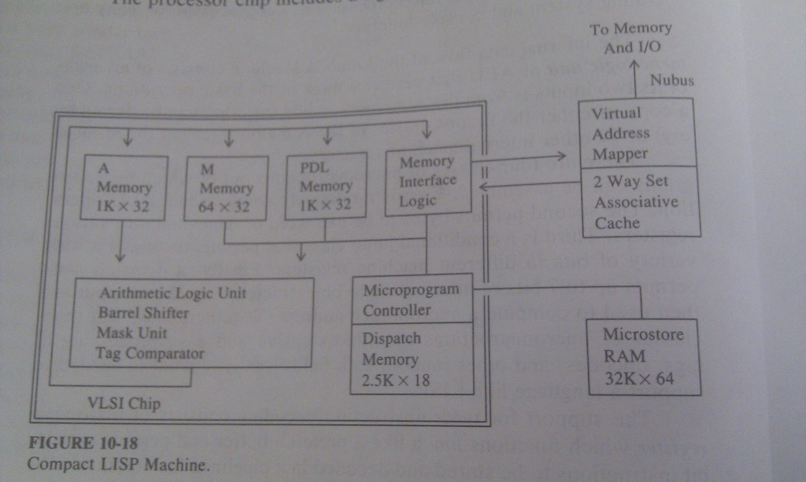
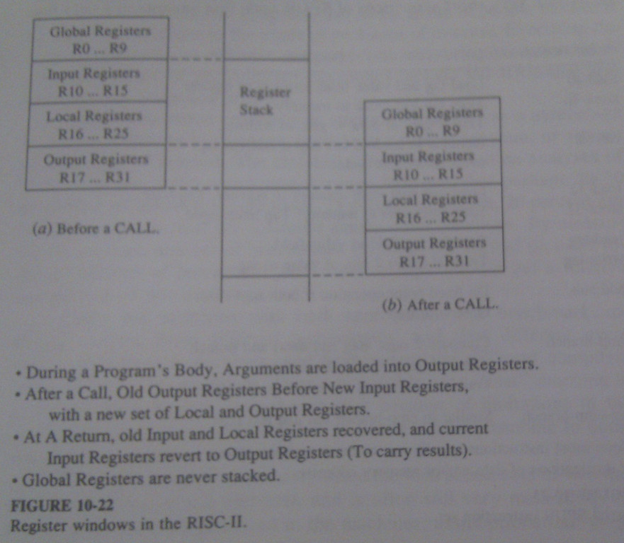
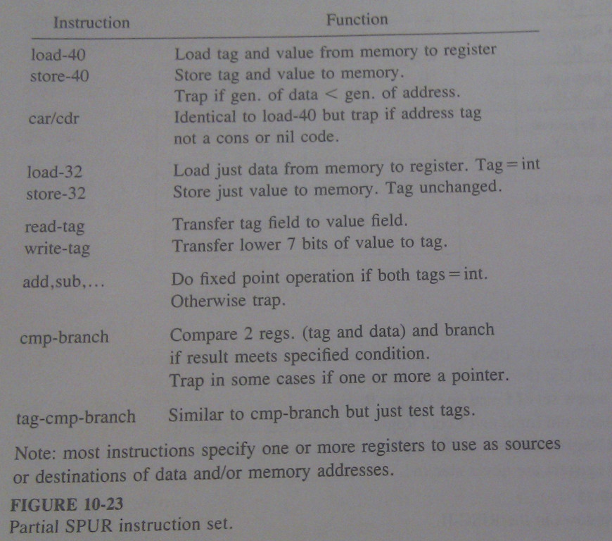

# Lisp: Variations and Implementations #

A brief history of Lisp implementations:

* The original ***Lisp*** (late 1950s) at MIT
* ***LISP 1.5*** in the early 1960s as the first standard
* ***MacLISP*** late 60s, an MIT upgrade (see Pitman, 1983)
* ***InterLISP*** early 70s, a West Coast variant (see Teitelman, 1978)
* ***ZetaLISP*** and ***LISP Machine LISP*** late 70s, commercial variants of
  MacLISP
* ***SCHEME*** mid 70s, a majo LISP variant much closer to lambda calculus (see
  Spring and Friedman, 1990)
* ***Portable Standard LISP (PSL)*** early 80s, an efficient version of Lisp
  from the University of Utah that was largely written in itself and is easily
  transported to new computers (Griss, 1983)
* ***Franz LISP*** early 80s, another variant of MacLISP optimized to run in
  UNIX (AT&T) environments (see Wilensky 1984)
* ***Common LISP*** early 80s, standardized combination of many of the previous
  variants (see Steele, 1984)
* ***MultiLISP*** mid 80s, Scheme with explicit support for parallelism (see
  Halstead, 1985, 1986)

For the reader interested in trying his or her hand at actually implemting
a Lisp system, we recommend Allen (1978), Henderson (1980), and Henderson et
al. (1983).

## The Original Lisp ##

The original Lisp was created by John McCarthy with &lambda; - Calculus in
mind. The basic computational model is that of expressions build by applying
functions to other expressions. Functions are themselves expressible in the
same format as any other data objects. Functions can be passed to and returned
by other functions.

Lisp is not a pure functional language. Operations that are integral to the
language permit different values to be bound to the same variable at different
times. The same symbol can have many different values at the same time, each of
which is accessed in a different way.

Functions are also not quite first class citizens in Lisp. While they can be
passed as arguments, doing so requires somewhat special coding and care must be
taken to avoid strange funarg problems. 

Expression evaluation is not in total agreement with our previous functional
model. Many Lisp forms include variants where a sequence of expressions are
evaluated ina a very specific sequential fashion. All but the last of these are
executed for their *side effects*.

### Major Language Components ###

Lisp has a variety of atomic data types: *integers, floating-point numbers,
literals, character strings, booleans, big-nums*. Major data structures
supported by Lisp are s-expressions. But arrays are supported as well.

### Variable Scopes and the Property List ###

So far we were working with ***statically scoped variables***. The expressions
that give them values can be determiined by a review of the static program
code. 

In List, a programmer can define certain identifiers to be ***dynamically
scoped***. The expression that bind values to them cannot be determined until
runtime. Such variables come in two forms. ***Global variables*** or ***special
variables***, which are visible to all expressions  whenever they are executed
in the program (unless they are masked by a local variable of the same name).
***Program variables*** are dynamically allocated at the beginning  of
execution of certain special forms and then act like global variables until
that form completes. 

There are two standard ways of implementing binding for such variables. First
is via an association list (called ***deep binding***),  which is quite slow.
The second approach is called ***shalow binding*** and the main idea is to
associate some unique global storage with the variable. Today, deep binding
predominates. 

### Built-in Pure Functions ###

There are many of them, interesting are:

* `(QUOTE E)` returns its argument as unevaluated s-expression
* `(SPECIAL (V1 ...Vn))` make V1 ... Vn special variables
* `(UNSPECIAL (V1 ... Vn)` releases associated storage

### Modifying Values ###

All these functions have form of:

	(<keyword> <address-expr> <value-expr>)

* `SET` sets a value into program variable
* `SETQ` the same as SET, but address-expr is not evaluated
* `CSET` sets a value into a global variable
* `CSETQ` 
* `rplaca`
* `rplacd`
* `nconc` non copying concatenate

### Special Forms ###

A ***special form*** is an expression whose function is a special keyword known
to the system, but unlike the built-ins, order of argument evaluation is
special.

* `(LAMBDA (<id>*) <body)` a function expression
* `(DEFINE ((<id> <expr>)*))` global function definition
* `(LABEL <id> <expr>)` global recursive function
* `(AND <expr>+)` evaluate expressions until first F
* `(OR <expr>+)` evaluate expressions until first T
* `(COND (<test expr> <body>)*)` nested conditionals
* `(PROG (<id>*) <progbody>)` sequential form execution
* `(GO <id>)` branch inside of PROG
* `(RETURN <expression>)` exit `<body>`

### System Functions ###

LISP has visible to the programmer a variety of direct hooks into its internal
operation. `EVAL` and `EVALQUOTE` both accept one argument which should be an
s-expression and return the result of evaluating the expression. `EVALQUOTE`
does not evaluate its argument before it evaluates it.

A Lisp compiler can be invoked using `(COMPILE (<id> <expr>)*)`. Now whenever
such an identifier is found in the function position of an application, the
compiled code will be invoked with its arguments evaluated.

***Macros*** are functions which, when they appear as a function in an
expression passed to the compiler, are executed by the compiler before the code
is executed. Arguments to the macros are not evaluated. The s-expression
resulting from executing macro is passed back to the compiler for the
compilation.

## Scheme - a Pure Lisp ##

Functions are truly first class citizens, identifiers are statically scoped,
tail recursive expressions are truly optimizable, and a  great deal of
attention has been given to a clean continuation mechanism.

### Scheme Syntax ###

	<basic-form> := <constant>
					| <identifier>
					| <LAMBDA <arg-list> <body>
					| (<basic-form> <basic-form>*)
					| (QUOTE <expression>)
					| (IF < basic-form> <basic-form> <basic-form>)
					| (begin <body>)
					| (SET! <identifier> <basic-form>)

	<body> := <basic-form>+
	<arg-list> := (<identifier>*)
					| <identifier>
					| (<identifier>+.<identifier>)

### Extended Syntax ###

The basic evaluator understands only the above syntax. To extend the spectrum
of special forms seen by the programmer, Scheme employs a very elegant
mechanism that is an outgrowth of the ***macro*** mechanism of the original
LISP, but that is more fully integrated into both compilation and
interpretation.

This mechanism has two parts, one records how a new special form should be
translated into an expression and a function that does the actual translation
into something the standard eval can handle.

The latter is called ***system syntax expander*** and consists of a database of
***pattern/expansion pairs*** and a function to search and use them. This
function, ***expand***, takes a single unevaluated expression as an argument
and looks recursively at any keywords found in the fnuction position of the
expression itself or any nested subexpression. After the successfull expansion,
the interpreter/compiler would be recalled on the expanded expression. 

### Bindings ###

As with the original LISP, identifiers in Scheme appear in two kinds, lambda
arguments and others. Lambda arguments are statically scoped. The other
mechanism is the `DEFINE` form. When executed at the top level, the form
defines ***global variables***. When executed inside of `LAMBDA` expression, it
auguments the current environment defined by lambda to include space for the
new variable and initializes it. After return from lambda, the binding is
discarted.

The approach taken to handle global variables is to define a specially globally
accessible ***fluid environment*** for ***fluid variables***:

	(FLUID-LET ((<identifier> <expression>)*) <body>)

Any function executed in this body, even one wohose definition is not withing
the `FLUID-LET`'s scope, can refer to a fluid variable and get the current
value.

### Suspending Evaluation ###

Clean treatment of function objects in Scheme permits inclusion of three
different mechanisms for suspending and resuming evaluation: ***delay*** and
***force*** functions for supporting futures, and enhanced ***continuation***
implementation that permits sophisticated co-routining, and an ***engine***
mechanism that permits specification and control of multitasking of individual
Scheme evaluations.

***Engine*** is a device that contains a continuation for some expression
which, when activated, runs that continuation for some specified period of
time. The Programmer has total control over how long and what to do if the
computation does not complete in that time. This permits elegant
multiprogramming executives to be built directly in Scheme without resorting to
any lower level programming languages. 

### Implementation ###

Identification of a small core language and an integrated way of extending the
language from that code means that optimization techniques can focus on
a relatively small set of forms. For the most part the compiler can determine
at compile time exactly what binding is associated with most symbols in the
body of an expression. This permits a compiler to know exactly when a set of
bindings is no longer useful. In turn, this means that much of a function's
environment can be kep in an easily managed stack. ***Tail recursion*** can be
implemented optimally by branches back to the beginning of a routine and by
reusing the same set of memory cells for each set of argumentsin the sequence
of calls. 

One of the first Scheme compilers was ***Rabbit*** (Steele, 1978). A good
compiler for the core set of forms was written in MacLISP, which generated LISP
code that could be compiled by the MacLISP compiler. This was then rewritten in
Scheme with optimization features added to it. Entire compiler came to about 50
pages of code. 

## Common Lisp - a Modern Standard ##

The multiplicity of LISP dialects was a healthy aspect of its first 25 years of
existence, as its primary users were academics. By the early 80s it had become
apparent that an industrial strength LISP was needed. ***Common Lisp*** is the
result.

It includes 7 types of numbers, with at least 7 more of complex numbers. Two
types of characters, bits, symbols, random states, unreadable data objects,
common round out the atomic types, structures, types and subtypes, keyword
arguments, multiple results from functions, exceptions:

	(CATCH <tag> <body>)
	(THROW <tag> <expression>)

It inherits static scoping, and special variables with scope similar to
Scheme's fluid variables. It supports streams.

***Evaluation*** is supported by `eval`, which evaluates the form in the
current special environment and a nil static environment. A variation of this
`(EVAL-WHEN {compile | load | eval} <form>)` specifies when the form should be
evaluated. 

## MultiLisp - a Parralel Lisp ##

***MultiLisp*** is a Scheme extension designed with parallelism in mind. It
adds several new forms. ***PCALL*** (***Parallel CALL***) has n + 1 arguments
all of which the programmer is willing to have evaluated in any order. When all
of them are computed, they are recombined as a normal MultiLisp expression and
evaluated. The next form is ***DELAY***, which takes its argument, packs it in
a closurelike structure, which can be passed around. When the value of the
argument is needed, it is ***forced*** and resulting value is substitued for
the closure.

***FUTURE*** is a form similar to DELAY, but after its creation, processor can
evaluate it in its free time.

### Implementation ###

The first implementation was on the ***Concert*** machine at MIT. The MultiLisp
programs were compiled into a SECD-like abstract machine ISA called
***MCODE***, which was then interpreted by an interpreter written as 3000 lines
of C. 

MCODE programs manage data structures called ***tasks*** that are accessed by
3 pointers: a program pointer, stack pointer, and environment pointer. 

The FUTURE function creates a new task and leaves it accessible for any free
processor. Deciding which task to run is done using an ***unfair scheduling
policy***.

Garbage collection is distributed across all processors. Each has its own set
of ***semispaces*** and employs a variant of Baker's algorithm. All processors
synchronize their flip, and a ***lock bit*** is associated with cell to prevent
it to be evacuated into multiple tospaces. 

A later version of MultiLisp called ***Butterfly LISP*** has been implemented
for the ***Butterfly*** parralel processor (Steinberg 1986, Allen 1987).

## The CADR Machine ##

The first machine build for Lisp specifically was ***CONS Machine*** at MIT 
1975 running MacLisp. CONS machine, althrough operational, had a variety of
weaknesses. In 1978 a new version, ***CADR Machine*** replaced it at MIT. It
represented an important point in computer architecture for specific languages
history and drove the design of many sytems, both academic and commercial. 

Some of the specific characteristics of the CADR:

* Optimization for high-performance, single user interaction
* LISP as the primary language for applications, interpreters, compilers,
  operating system functions.
* Data type checking support in hardware
* Large memories (for the time)
* Built-in memory allocation and garbage collection

Major hardware support was included for a ***push-down list***,
or ***PDL buffer***, which would keep up to the top 1K entries of a stack very
close to the main dataflow. This stack served many of the functions of the S,
E and D stacks in the SECD Machine. Invoking new functions involved
constructing ***frames*** ot control information on it that contained:

* a pointer backwards in the stack to the previous frame
* cells for argument values
* cells for local variables and constants
* cells for special variable access

Operands for built-in functions invoked insie a function's body were
push/popped from the stack space in front of the current frame. 

### Memory Structure ###

Memory in the CADR machine consists of a single 16-million word virtual address
space, with up to 1 million words of real memory. Thus, data and instruction
addresses in their complete form take 24 bits.

The format of an individual memory cell reflects SECD influences. Each 32 bit
long cell contains a tag, a cdr code, and a value field.

Different types of objects are kep in different areas of the memory, not for
***BIBOP*** like tagging, but for symplifying garbage collection. ***Garbage
collector*** is incremental Baker's algorithm. With every CONS some few cells
are copied to another region. 

### Program Forms ###

Programs for this machine can be represented in three forms - ***MacLISP***,
***microcode***, and ***macrocode***. Microcode provides most of the major
system functions (virtual memory management, GC etc.). The middle level
- macrocode - supports stacks much as the SECD Machine did, but in a format
more resembling conventional instruction set. The general form of such
instruction is

	<operation>, <operand>, <destination>

where the operation is usually a very generic one (add, cons ...). Individual
macroinstructions include a variety of wrinkles that improve performance (for
example when creating a list of known length etc.).

## CADR Derivatives ##

Althrough the CADR Machine was designed as a one-of-a-kind research machine, it
spawned a series of commercial derivatives that were oprimized for LISP
execution in a high performance, single-user workstation environment. 

### The LMI Lambda LISP Processor ###

***Lambda LISP Processors*** by Lambda Machines, Inc., were some of the first
commercially available machines tailored for Lisp. They were fairly close to
CADR based designs with following additions:

* a richer set of tag values
* two memory word sizes, 32bit size that supports a 25 bit virtual address
  space, and a 40 bit size that supports 32 bit address space.
* larger PDL stack buffers up to 2K words
* an internal 4K word A memory, which can be used by microcode for internal and
  temporary results
* a sectored 4K word cache in front of memory
* a standardized bus, the ***Nubus***, to connect the back of the cache to
  memory and I/O cards
* larger (64bit) microinstruction word length
* virtual microstore mechanism that permits up to 8K words of microprograms to
  be pages ina as needed from a larger 64K word space on disk
* Direct HW support for many arithmetic functions
* a faster, 100ns clock speed
* a motorola 68000-series microprocessor as a coprocessor for many operating
  system and console functions

### The Texas Instrucments Compact LISP Machine ###

The overall architecture of the machine resembles that of the Lambda machine,
with the major difference being in the cache (a more modern, two-way set
associative design), in support for garbage collection (8 status bits for each
8K-word region of memory), and in the use of page bits to extend the real
memory address space to the full capacity of the Nubus, namely, 1 gigaword.

The processor is also pipelined, with the capability of initiating a new
microinstruction each microcycle. A goal of 25ns per clock cycle offers
performance substantially in excess of earlier machines.

### The Symbolics 3600 ###

These machines range from cabinet-sized machines with multiple cards to support
the basic CPU to modern custom VLSI designs that capture most of the same logic
in a single chip (the ***Ivory Processor***).

Althrough built for ***ZetaLISP***, it also adapts well to Common Lisp, and to
supporting both traditional languages like Fortran and Prolog.

Both the architecture of the machine and ZetaLISP permit separate processes to
be created. The current state of each process is foverned by a ***stack
group*** consisting of three stack pointers and their associated areas in
memory. The ***Control Stack*** represents a combination of all four of SECD
Machine registers. It contains a ***frame*** for each nontrivial function
application that is still pending. There are two pointers - ***Stack Pointer***
and ***Frame Pointer***. 

Function calls are handled similarly to modern standards, a frame is created,
arguments evaluated one at a time, and return instruciton discards the frame
and passes execution to the parent frame. The return values replace the
arguments on the stack. The overhead for just the CALL and RETURN instructions
was as little as 20 machine cycles.

The second stack is the ***binding stack*** which supports ***shallow
binding***. When required, the current bindings of such variables are pushed
onto this stack in 2-word pairs. The first of these is a pointer to the special
variable's value cell, and the second is the value at the time of the push. The
cdr-code field of these cells is used to designate such things as use of the
variables in a closure. Completion of an expression that releases a set of
special bindings causes this stack to be popped an appropriate number of times,
with each pair of words giving an address of a cell to change and the value
that it should resume. Information in the stack frame indicates how much of the
binding stack should be unwound at each function return.

The final stack is the ***data stack***, which is akin to a heap in
a conventional machine. 

3600 had a sophisticated descendant of Baker's algorithm. Given the potential
size of the memory space, 256M words, and its structure as a virtual store
where perhaps one-thirtieth of all memory is in fast RAM and the rest is on the
disk, it is impossible to conceive a mark-sweep type of algorithm. The space is
simply too big. 

Several solutions are employed. First is to separate memory into ***areas***.
The ***ephemeral area*** contains object whose lifetime is likely short. This
area is scavenged and compacted frequently. Next is ***dynamic area*** with
object living longer, but not for the indefinite time. Globals and special
variables fall into this category. Collection occurs only when it has exceeded
some predetermined capacity. Finally there is ***static area***, whose objects
are assumed to exist forever. System code and tables for example. Garbage
collection usually occurs only when user commands.

To prevent accidental collection of ephemeral objects requires knowing when any
reference to such object is stored elsewhere. This was done by the hardware by
monitoring each store into memory. If the value being stored is address and it
points to the ephemeral area, a bit associated with the page containing the
location being modified is set. Conceptually, collecting the ephemeral area
requires scavenging all pages whose bit is set for references to that area. 

The actual process of scavenging and copying is also done to minimize future
work. Tospace is incrementally increased as needed.

## The SPUR RISC ##

One of the strongest trends in current computer architecture is towards
***Reduced Instruction Set Computers*** (***RISC***). In general RISCs have
following characteristics:

* a small number of simple instructions
* a large number of registers
* most, if not all, access to memory is through just load and store (i.e. no
  memory to register adds, etc.)
* almost all operations like add, compare, etc., are register to register, with
  the result going back into a register
* in most cases new instructions can be started at a rate of one per machine
  cycle
* an overall architecture which made generating optimized machine code from
  a high-level language easy

One of the first such RISCc was the ***Berkeley RISC-I***, shortly followed by
***RISC-II***, which included:

* ***register windows*** where registers accessible to the program are just
  part of a larger stach of registers, and at each call to or return from
  a subprogram, all or part of this set slides down and up.
* ***delayed branches*** where one or more instructions immediately following
  a branch will be executed even if the branch is taken.
* an efficient ***trap mechanism*** that will suspend execution of a program
  when certain circumstances have been detected, and start up some prespecified
  routine in its place.

The ***SPUR*** is a variant of RISC-II optimized for handling languages such as
Lisp, Prolog, or Smalltalk. Each register and memory cell is 40 bits, with
6 bits for tags, and 2 holding ***generation number*** used by the GC. 

The trap facilities are used to advantage by streamlining many instructions to
work only for the *expected* cases, and trap to predefined routines to handle
the atypical ones. The net effect of this is that most LISP functions compile
very easily into very short sequences of SPUR code that execute ina very few
machine cycles (CONS for example, compiles into 4 instruction sequence). Again,
special conditions such as stack overflow are handled by setting up
*inaccessible pages* at the ends of the allocated stack and letting a memory
management trap handle the cases where something must be done. 

Projected LSIP benchmark performance for 150-ns SPUR indicates that with the
exception of heavy floating-point benchmarks, it is as much as 4.9 times faster
than a Symbolics 3600 (with a slightly slower cycle time) and more than 10
times faster than a DEC VAX 8600 (which issues instruction twice as fast as the
SPUR).

## Benchmarking ##

Actual comparisons of these machines was written by Gabriel (1984):
***Performance and Evaluation of Lisp Systems***.

