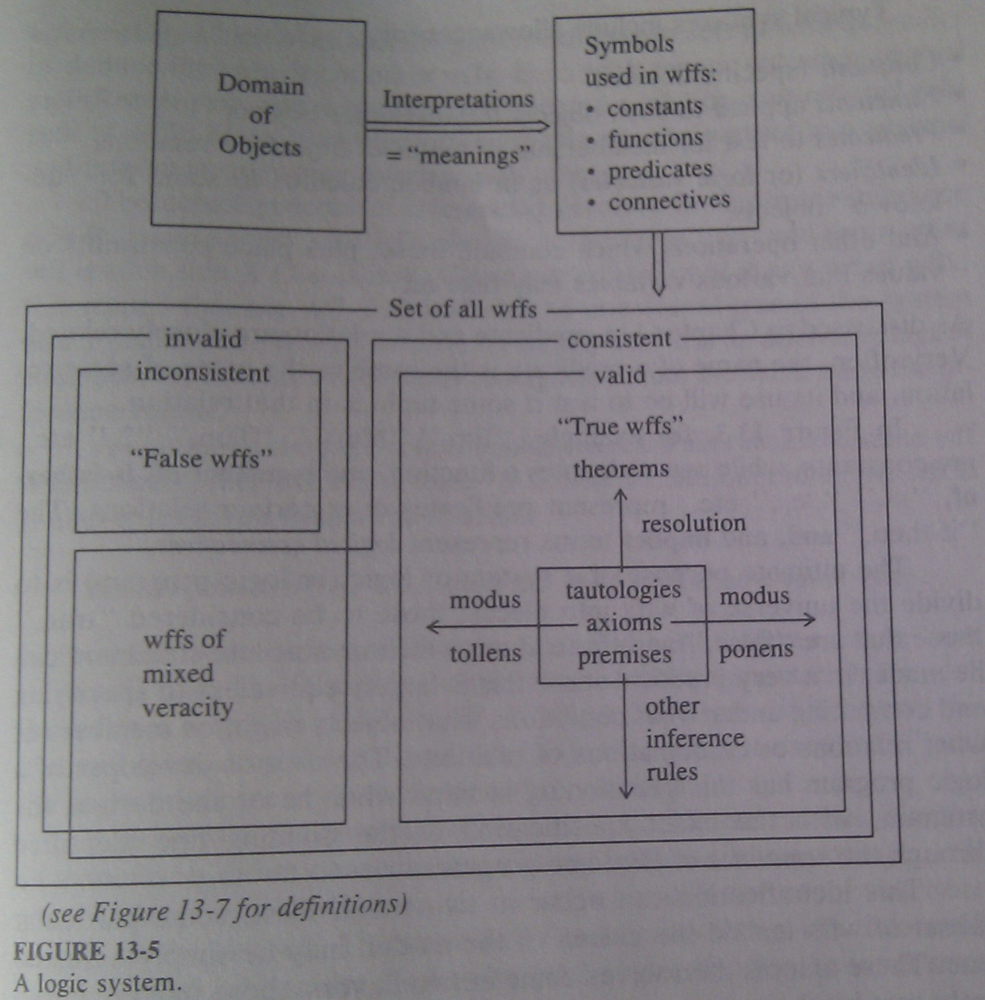
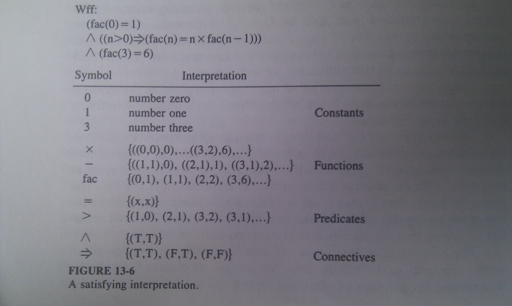
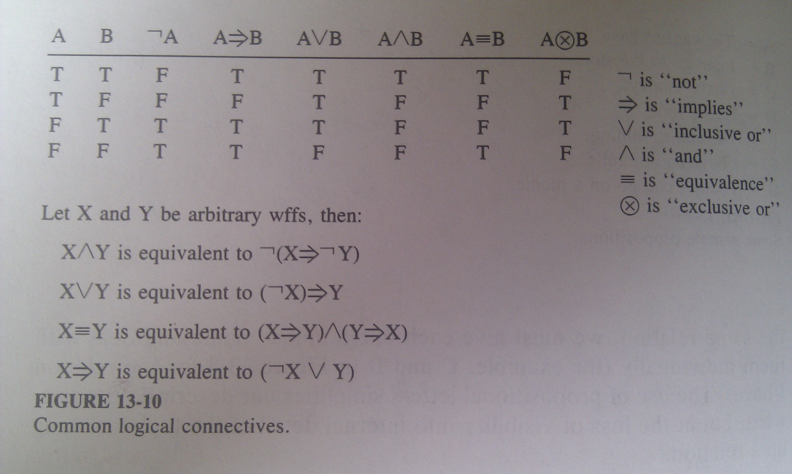
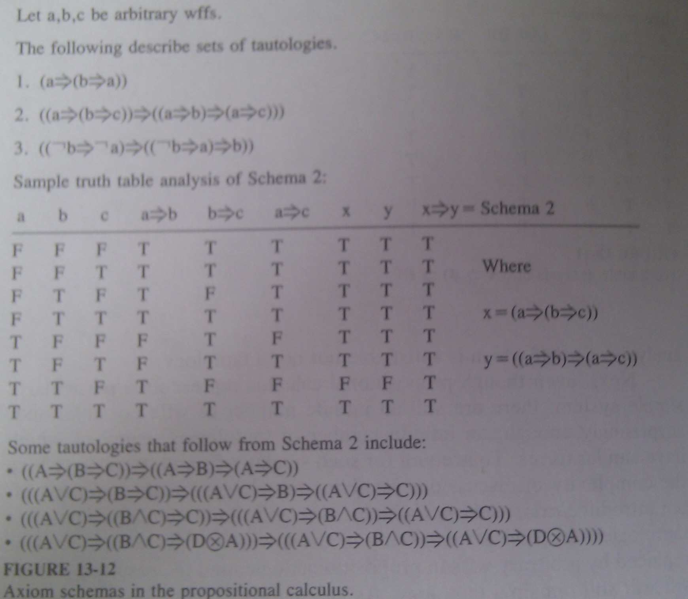
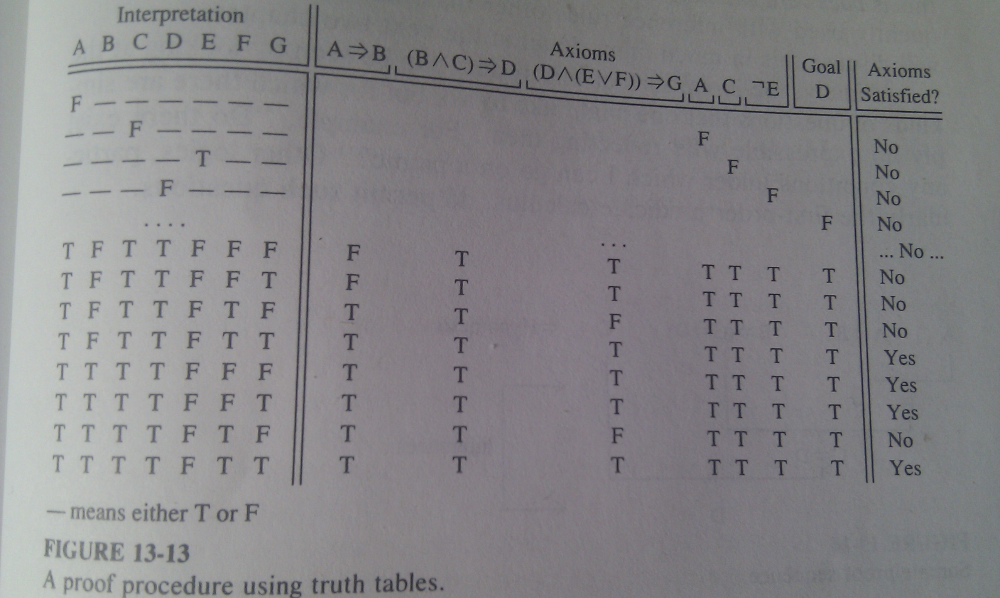

# A Logic Overview #

The primary kind of statement with which logic computing deals is a ***fact***.
A ***fact*** is an expression that some object or set of objects satisfies some
specific relationship.

## Formal Logic Systems ##

The ***sytax*** of a logic model revolves around ***logical expressions***
built up from a set of more basic ***symbols***. A subset of symbol strings
representing valid expressions is called ***well-formed formulas*** (or
***wffs***). Individually, they are called ***statement, proposition,*** or
***sentence***.

Typisal syntaxes include allowances for:

* ***constants*** (specific objects)
* ***functions*** applied to such objects to yield other objects
* ***predicates*** to test membership of tuples of objects in relations
* ***identifiers*** or ***logic variables*** stand for *unknown* objects
* other operations which combine these or place constraints on values that
  various variables may take on.

The ultimate purpose of a system of logic is to divide the universe of wffs
into pieces; those to be considered true, those that are false, and those about
which no absolute statement can be made.

In most real logic programming languages the user provides ***axioms***, rules
that are considered true. 

### Rules of Inference ###

Axiom specification provides only part of the information needed. In a properly
written program, other parts of the language's semantics extend these
statements to cover other statemenets which fully define the true and false
sides of the wff set. This extension is done via ***inferencing***, which uses
specific patterns of known sets of wffs to predict or deduce the veracity of
other wffs. Each such pattern is called an ***interence rule***. 

The actual process of inferencing involves finding some inference rule `R`,
some subset `X` of wffs already in the true set, and some other wff `a`
such that `X + a = R`. Given our definition of `R` as a set of wffs, this means
that the wff `a` should also be considered true. We say that `a` is an
***inference, logical consequence, conclusion*** or ***direct consequence***
from the set `X` using the inference rule `R`. 

Common inference rule is ***modus ponens***. This rule takes some wff `A` and
some other wff of the form `if A then B`, and infers that the wff `B` is also
true:

	modus-ponens={(A, 'if A then B', B)|A and B any valid wffs}

A ***proof*** is sequence of wffs `a1...an` such taht eack `ak` is either an
axiom or direct consequence of some subset of the prior `aj`.

A ***theorem*** is a wff `a` which is a member of some proof sequence, usually
as the last wff. The notation `Γ⊢ a` indicates that `a` is a theorem in the
system of logic under discussion (with Γ standing for the input set of axioms
specified by the logic program).

### Properties of Inference Rules ###

A set of inference rules which does not infer a theorem which is not in the
overall true set, is called ***sound***. On the other hand, we want the
inference rules to permit proofs for all true wffs that are derivable from te
axioms - such set is called ***complete***.

Slight variations of the theorem concept will also be of interest, for example
to find out if some wff would be true if we added some set of wffs. These are
called ***hypothesis, premissses***. If a proof sequence exists which includes
members of hypotheses  as axioms, then this sequence is called ***deduction***
and is noted `Γ, Y⊢ a`. It is roughly equivalent to `Γ⊢ (if Y then a)`

A ***consistent*** set of wffs does not permit derivation of contradiction. In
most cases this is important property of an axiom set and one the logic
programmer must strive to achieve.

### Decision Procedures ###

Finding inferences and proof sequences is an important part of logic-based
computing. The programmer specifies a set of axioms and then asks questions
about other wffs and their validity. The system will then try various
combinations of inference rules in an attempt to find a proof sequence. We
would like some guarantees that the questions we ask are answerable in finite
time. We also expect that the search will be more efficient than trying all
possible combinations technique, which is called ***exhaustive search*** or
***British Museum search***.

There are systems which are ***undecidable***, there is no algorithmic approach
for determining whether a particular wff is true or false. 

### Interpretations ###

Another key part of the semantics of a logic expression is the specification of
an ***interpretation*** that maps a meaning to each symbol. This starts with
a ***domain*** that defines the set of possible values or objects to be dealt
with. Functions are assigned definitions (mappings) from some domains to
others.  Symbols used as predicates map into tests on relations over these
domains. 

The key point here is that there is often an infinite number of interpretations
and combinations of interpretations which can be given the symbols used in wff
or set of wffs. The prime definition is that a wff is ***true under an
interpretation*** if the result of ***evaluating*** the wff under the
interpretation is true. The specified interpretation ***satisfies*** the wff.

We say that two wffs are ***equivalent*** if they evaluate to the same
true/false values for every possible interpretations.

### The Deduction Theorem ###

The above definitions lead to a very important result called the ***deductioin
theorem***, which will drive many of the inference engines. 

The wff `G` is a logical consequence of the wffs `A1...An` if and only if the
wff:

	if (A1 ∧ A2 ... ∧ An) then G

is valid (i.e. a tautology). 

The second form of the theorem states that the wff `G` is a logical
consequence of the wffs `A1...An` if and only if the wff

	A1 ∧ A2 ... ∧ An ∧ ¬ G

is unsatisfiable.

## Propositional Logic ##

Perhaps the simplest system of logic that demonstrates most of the syntactic
and semantic features mentioned is ***propositional logic***. In the syntax for
this logic, a ***proposition, propositional letter*** or ***atom*** corresponds
to a declarative sentence that may take on interpretations of true or false.
There are no functions or nonboolean constants.

Example:

	A = The car has gas.
	B = I can go to the store.
	C = I have money.

Construction of wffs from these letters involves combinations using ***logical
connectives*** - functions over `{T,F}x{T,F}->{T,F}. 

	<proposition> := A|B|C...
	<binary-connective> := ⇒ | ∧ | ∨ | ≡
	<unary-connective> := ¬
	<wff> := <proposition>
			 | (<unary-connective><wff>)
			 | (<wff> <binary-connective> <wff>)

## A Simple Inference Engine ##

All real propositional logic programs have more than one axiom.

### A Brute-Force Inference Engine ###

We can outline a simple ***truth table-driven inference engine*** for
propositional logic.

Given set of axioms `X` and some new wff `G` (goal), we want to determine that
it is a theorem in our system, namely, does `X⊢ G`. Since this is propositional
logc, `G` is an expression involving propositional letters and connectives. The
operation of the inference engine is:

1. Pick an interpretation (assignment of T and F to letters) that has not been
   tried before.
2. If all interpretations have been tried, we are done and G is a theorem
3. If the interpretation does not satisfy the original axiom set `X`, ignore it
   and go back to 1.
4. Try the interpretation an `G` using the standard definitions of all
   connectives.
5. If the result is F, quit, `G` is not a theorem.
6. If the result is T, go back to 1.

### A Modus Ponens-Based Inference Engine ###

For large problems, the above is not usable (for 30 letters, full table would
require over 1 billion interpretations). The use of inference rules in the
engine drastically decreases this combiinatorial explosion by handling with one
symbolic operation many common parts of the truth table. For proposition
calculus, only one such rule is needed - ***modus ponens***. This rule states,
that if one is given as valid the pair of wffs `x` and `x ⇒ y` (where `x` and
`y` are arbitrary wffs), then the wff `y` is also valid. This engine requires
that all wffs are written in form using only `not ¬` and `implies ⇒`.

Inference engine:

1. (Decision Procedure) Pick two wffs from the axiom set, where one of these
   wffs has ⇒ as its outermost connective.
2. (Application of Inference Rule) Verify that the antecedent part of the axiom
   with the outermost ⇒ exactly matches the other axiom.
3. If no match occurs, go back to 1.
4. If a match occurs, compare the consequent with `G`
5. If the same, quit with answer yes.
6. If different, add the consequent to the axiom set, and go to 1.

Eventually, this process will generate all wffs which can be deduced from the
original set. If one of them matches, the goal is theorem. 

### Other Inference Rules ###

There are other inference rules with the same logical power. ***Modus
tollens*** and ***resolution*** and a myrid of variations. ***Modus tollens***
is like running modus ponnens backwards. Given a wff `¬y` and another wff `x
⇒ y`, we can infer the wff `¬x`. This is the same as stating `¬y,(x ⇒ y) ⊢ ¬x`.
Again, modus tollens requires wffs expressed only with `⇒` and `¬`.

***Resolution*** is a little different, since it is normally used when
individual wffs are expressed in ***conjunctive normal form***, which is the
`and ∧` of terms built only from `not ¬` and `or ∨`. It can be viewed as
a *chaining rule*, which takes two wffs of the form `x ⇒ y` and `y ⇒ z` and
infers `x ⇒ z`. In their conjunctive form, these wffs look like `(¬x ∨ y)` and
`(¬ y ∨ z), with the resolution simply *combining* the two wffs and *cancelling
out* the `y` from one and the matching `¬y` from the other.

## A Sample Problem ##

Propositions:

	A = The car has gas.
	B = I can go to the store.
	C = I have money.
	D = I have food.
	E = The sun is shining.
	F = I have an umbrella.
	G = Today I can go on a picnic.

Initial set of axioms:

1. `A ⇒ B` #If the car has gas, then I can go to the store
2. `(B ∧ C) ⇒ D` #If I can go to the store and I have manoy, then I can buy food.
	> Note: when we translate this wff into a form using only ⇒ and ¬, there
	> are several possibilities e.g. `B ⇒ (C ⇒ D)` or `C ⇒ (B ⇒ D)`
3. `(D ∧ (E ∨ F)) ⇒ G` #If I have food and either the sun is shining or I have an umbrella, then today I can go on a picnic.
4. `A` #The car has gas
5. `C` #I have money
6. `¬E` #The sun is not shining

Stating that all these wffs are axioms is equivalent to assuming they are
always evaluated to true. Since they are not tautologies in themselves, this is
equivalent to *and*ing them all together into one big wff, and constraining the
interpretations which we use to solve problems using them to ones that make
this single wff evaluate to tru. For example, the fourth axiom constrains all
interpretations to ones there the `A` is assigned true. Likewise, the axiom
1 excludes any interpretation in which `A` is true and `B` is false. Note that
modus ponens would deduce from these two that `B` is also true. 

In structure, the first three of these program wffs are axioms that define
***if-then rules***, while the next three correspond to ***facts***. It is
important to emhasize that this later set represents inherent tautologies, the
truth of the others is due totally to the wishes of the programmer of the
system.

Examples of the kind of wff questions that one might ask are:

* `D` #Is it true that I can buy food?
* `F ⇒ G #Is it true that if I have an umbrella, then I can go on a picnic?

Again, asking a question in this system is equivalent to identifying a wff and
asking if it is in the set of true wffs deducible from the axioms and inference
rules. It is up to the decision procedure to mechanically find the proof
sequence, if it exists. 

For propositional logic, the simplest possible proof procedure is to simply do
a truth table analysis, i.e. look at all possible assignments of true/false to
all the propositions used in the axiom set and gual and see if there is at
least one interpretation (one row) that makes all the original axioms and the
goal true at the same time. 

Of the 128 possible interpretations only 4 satisfy all the axioms.

Another possible decision procedure involves beating these wffs (using an
inference rule) against each other and any new wffs as long as new wffs are
inferred. As each is inferred, it can be compared to the desired question.
A match ends the computation. As an example, a proof sequence for `D` using
only modus ponens:

* From `A` and `(A ⇒ B)` infer `B`
* From `B` and `(B ⇒ (C ⇒ D))` infer `(C ⇒ D)`
* From `C` and `(C ⇒ D) infer `D`

The general term for this kind of inference is ***forward chaining***, or
***antecedent reasoning*** since the system is expanding forward from known
wffs to new ones.

There is an alternative decision procedure that involves picking a wff whose
truth value is desired and working backwards.At each step, one tries to find
a wff which, if one used modus ponens between it and some other wff, would
infer the desired wff. This other wff then becomes the new question. This is
***backward chaining*** or ***consequence reasoning***.
