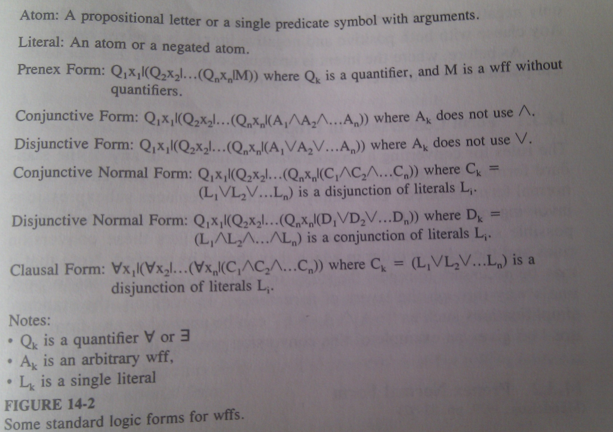

# Predicate Logic and the First Inference Engine #

One of the problems with propositional calculus is its inability to make
*logical generalizations*. Sometimes we need to say `For any x, if x is
something, then x has a property`. ***Predicate-based logics*** allow us to do
this by replacing the statement letters by ***predicate expressions*** that
test whether or not certain combinations of objects, or tuples of objects, are
members of certain relations. 

The simplest and the most used system is ***first-order predicate*** calculus.
Besides predicates, it introduces ***constants, functions, variables*** and
***quantifiers***. Constant identify specific objects (John, 3), functions
indicate how to map one or more objects specified as arguments into other
objects. Variables may take on values from the domain of objects expressible
from the functions and constants, and may be used freely in any place where
constants or functions are permitted. All three may be combined into ***logic
expressions***.

Quantifier takes a variable and a logical expression containing copies of that
variable and specifies how much of the relevant domain of objects needs to be
substituted for that variable to make complete expression true. Quantifiers
***Bind*** identifiers and specify where values for those identifiers should be
substituted. The most common are `all objects` and `at least one object`.

Together, these additions make it possible to express statements such as `For
all x, if x is human, then x has a mother.`

## Basic Syntax ##

	<constant> := <symbol> | <number>
	<functor> := <symbol>
	<predicate-name> := <symbol>
	<identifier> := <symbol>
	<tuple> := (<term> {,<term>}*)
	<term> := <constant> | <identifier> | <functor><tuple>
	<atom> := <predicate-name><tuple>
	<literal> := <atom> | ¬<atom>
	<binary-connective> := ∧ | ∨ | ≡ | ⇒ | ⊕
	<quantifier> := ∀ | ∃
	<wff> := <literal> 
			 | ¬<wff>
			 | (<wff><binary-connective><wff>)
			 | (<quantifier><identifier>'|'<wff>)

### Atoms, Literals, and Predicates	###

***Atom*** consists of the name of a relation prefixed to a tuplne whose elements are
terms. The meaning is that under an interpretation the atom evaluates to true
if the object specified by the tuplne is in the set defined by the relation.

***Literal*** is an atom with an optional ¬ prefixed. 

While atoms and terms have identical syntax, they are used in different places.
Terms represent objects and appear as arguments to functions or atoms. Atoms
represent the most basic wff construction and may never appear as arguments. 

Atoms can be interpreted as boolean tests, with the predicate name reflecting
the type of test to be applied to the tuple. Perhaps the most useful such
predicate is ***equality***. 

### Wffs and Quantifiers ###

A ***wff*** is a logical expression built up from atoms combined by the standard
logical connectives from propositional calculus plus quantifier symbols to
scope identifier bindings. Quantifiers are followed by a ***binding variable***
and a wff making up the quantifier's body. 

***Universal quantifier ∀*** defines a wff which is true only if the sub-wff
making up its body remains true regardless of what values are given to the
binding variable. 

***Existential quantifier ∃*** forms a wff which is true if there exists as
little as one object which if substituted for the free instances of the binding
variable in the body, make it true.

## Basic Interpretations ##

Again, an ***interpretation*** is a description of what a wff means, the
***semantics*** of the wff. For our purposes, we define an interpretation as
having two parts. First, the ***permanent*** part, is constant across all wffs
in a language. This includes primarily the definition of the logical
connectives and the quantifiers. Second are a programmer-defined mapping of
values to the various other symbols that make up a wff. Such interpretations
may wary from wff to wff or even somethimes among different parts of a large
wff. This includes:

* Constant symbols are assigned some specific actual values
* Function symbols are assigned some mappings, and terms computed as function
  applications from those mappings and the constant interpretations.
* Predicate symbols are assigned relations, with predicates given true/false
  values on the basis of whether or not their arguments form valid tuples in
  the relation. 

Now given an interpretation, we can ***evaluate*** an unquantified wff by the
following:

* Compute terms as the appropriate function applications.
* See if the tuples formed by the evaluated terms are in the associated
  relations.
* If so, mark those atoms as true.
* If not, mark the atoms as false.
* Combinations of atoms joined via the logical connectives are interpreted
  exactly as in propositional calculus.

Universal quantifier in from of a wff causes the above procedure to be repeated
for every possible object. This means that if we have a wff such as
`(∀x|P(x))`, it is totally equivalent to multiple copies of the body
***and***ed together, one per possible domain value. 

	(∀x|P(x)) ≡ P(red) ∧ P(white) ∧ P(blue)

Existential quantifier is similar, only ***or***ed

	(∃x|P(x)) ≡ P(red) ∨ P(white) ∨ P(blue)

## Standard Expression Forms ##

### Form Conversions in Propositional Calculus ###

### Prenex Normal Form ###

### Skolem Standard Form ###

Next step in conversion process is elimination of all existential quantifiers
in a wff in prenex normal form. The result is ***Skolem standard form***. The
rules for conversion are a combination of prior procedures and several rather
different new ones. Removal of the existential quantifiers requires invention
of what are called ***Skolem constans*** and ***Skolem functions***. 

Consider a wff which leftmost quantifier is ∃. ***Skolemization*** removes
a leading `∃x` and replaces all free occurences of `x` in the rest of the wff
with a new constant symbol, which is not used anywhere else but is used solely
in the wff to represent the *magic value* which has to exist in order for the
wff to be true.

This new constant is called ***Skolem constant*** and its purpose is to name
the value which satisfies the wff. Instead of saying `There exists an x such
that...` we are saying that the object exists with some unambiguous name.

If the wff does not start with ∃, ut with ∀, the process is more complex. 

	`∀x1...∀xk-1 ∃xk ... M

The meaning of this is that regardless of what values we pick for `x1..xk-1`,
there is still some value we can give to `xk` to make the rest of the wff true.
However, this value can vary with varying `x1...xk-1` values. To remove
existential quantifier, we will do as before. We will create a special symbol
to represent the value for `xk`, but it must be a function - ***Skolem
function*** of `k-1` arguments. Assuming tha function name `gk`, we can delete
`∃xk` by replacing all instances of `xk` with `gk(x1, ...xk-1)`.

Example:

	∀x|∃y|(¬human(x) ∨ is-mother-of(y,x)

Choice of y depends on value of x. We will define skolem function
`mother-of:D→D`

	∀x|(¬human(x) ∨ (is-mother-of(mother-of(x), x))

## Clausal Form ##

