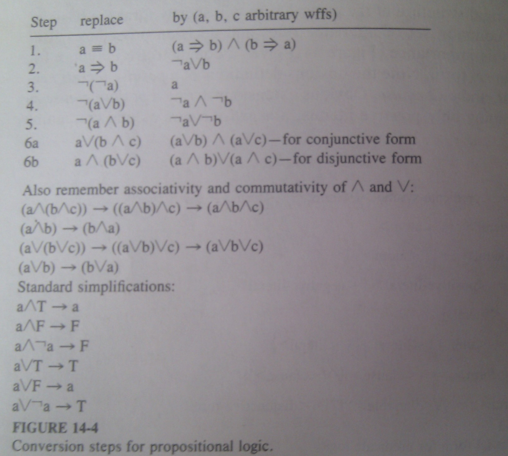
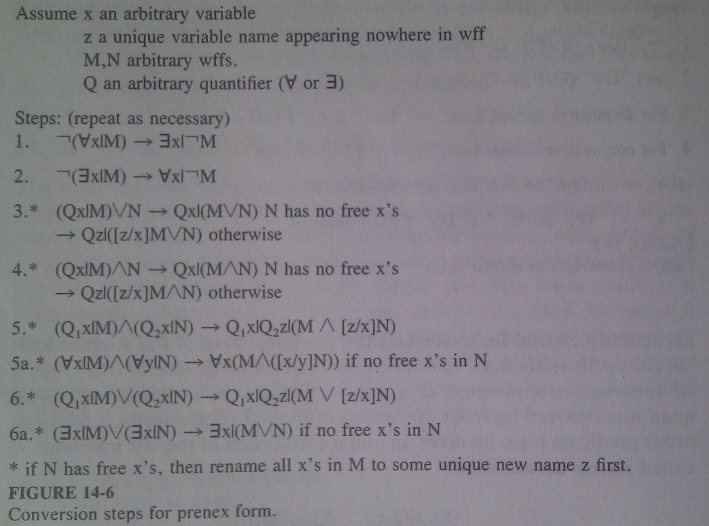
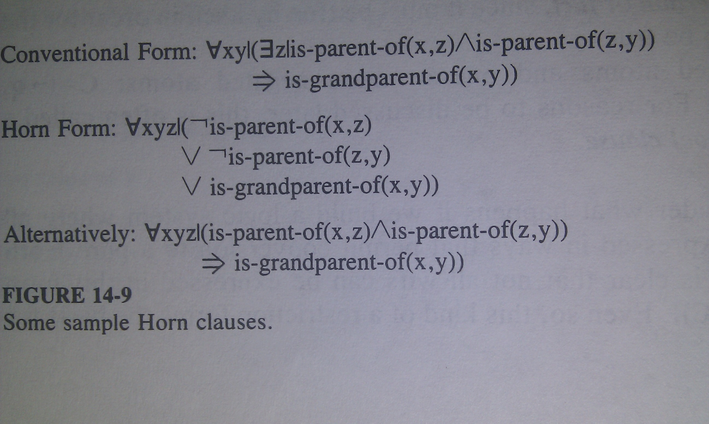
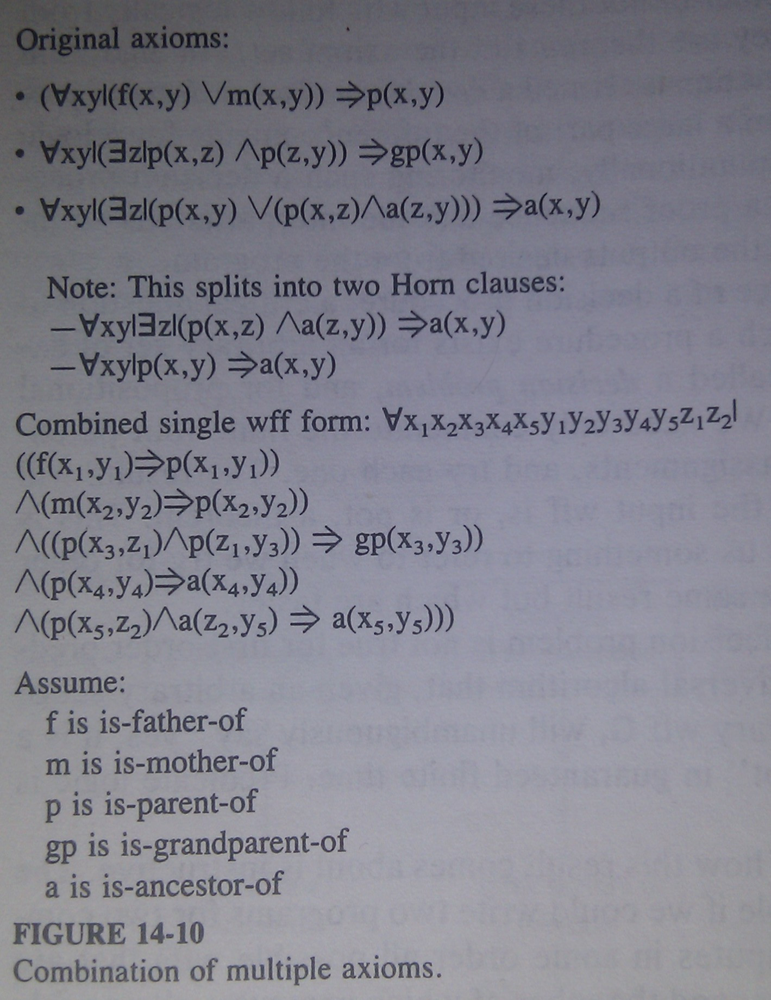
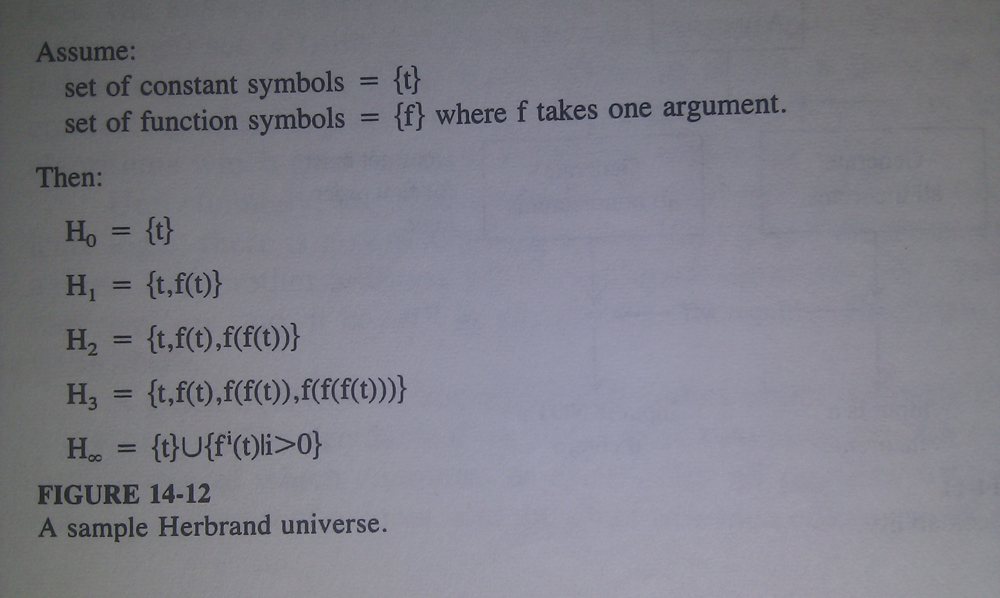
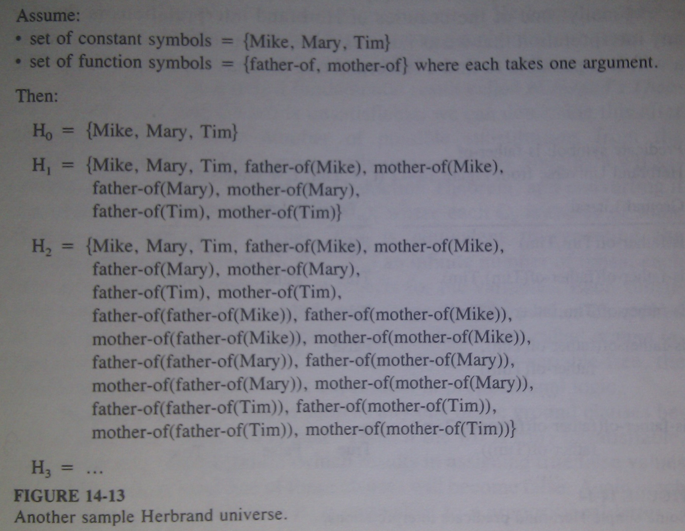
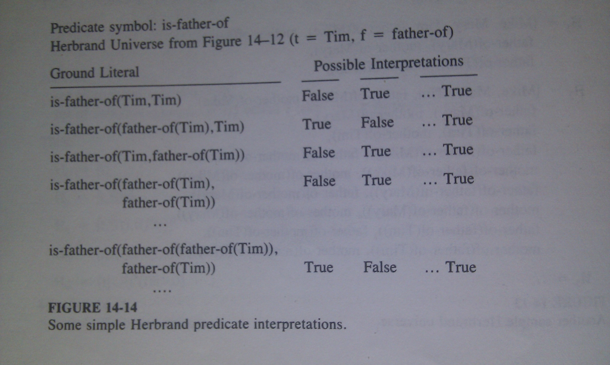
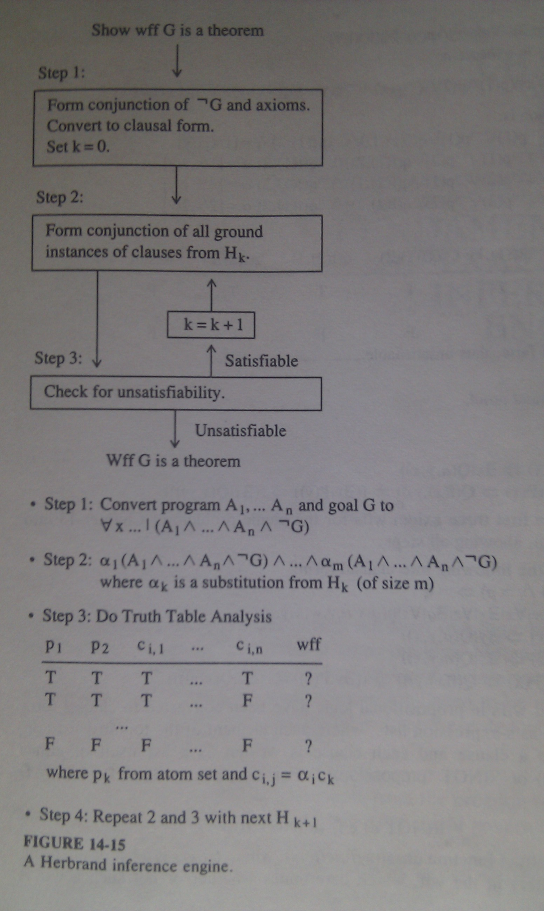

# Predicate Logic and the First Inference Engine #

One of the problems with propositional calculus is its inability to make
*logical generalizations*. Sometimes we need to say `For any x, if x is
something, then x has a property`. ***Predicate-based logics*** allow us to do
this by replacing the statement letters by ***predicate expressions*** that
test whether or not certain combinations of objects, or tuples of objects, are
members of certain relations. 

The simplest and the most used system is ***first-order predicate*** calculus.
Besides predicates, it introduces ***constants, functions, variables*** and
***quantifiers***. Constant identify specific objects (John, 3), functions
indicate how to map one or more objects specified as arguments into other
objects. Variables may take on values from the domain of objects expressible
from the functions and constants, and may be used freely in any place where
constants or functions are permitted. All three may be combined into ***logic
expressions***.

Quantifier takes a variable and a logical expression containing copies of that
variable and specifies how much of the relevant domain of objects needs to be
substituted for that variable to make complete expression true. Quantifiers
***Bind*** identifiers and specify where values for those identifiers should be
substituted. The most common are `all objects` and `at least one object`.

Together, these additions make it possible to express statements such as `For
all x, if x is human, then x has a mother.`

## Basic Syntax ##

	<constant> := <symbol> | <number>
	<functor> := <symbol>
	<predicate-name> := <symbol>
	<identifier> := <symbol>
	<tuple> := (<term> {,<term>}*)
	<term> := <constant> | <identifier> | <functor><tuple>
	<atom> := <predicate-name><tuple>
	<literal> := <atom> | ¬<atom>
	<binary-connective> := ∧ | ∨ | ≡ | ⇒ | ⊕
	<quantifier> := ∀ | ∃
	<wff> := <literal> 
			 | ¬<wff>
			 | (<wff><binary-connective><wff>)
			 | (<quantifier><identifier>'|'<wff>)

### Atoms, Literals, and Predicates	###

***Atom*** consists of the name of a relation prefixed to a tuple whose elements are
terms. The meaning is that under an interpretation the atom evaluates to true
if the object specified by the tuple is in the set defined by the relation.

***Literal*** is an atom with an optional ¬ prefixed. 

While atoms and terms have identical syntax, they are used in different places.
Terms represent objects and appear as arguments to functions or atoms. Atoms
represent the most basic wff construction and may never appear as arguments. 

Atoms can be interpreted as boolean tests, with the predicate name reflecting
the type of test to be applied to the tuple. Perhaps the most useful such
predicate is ***equality***. 

### Wffs and Quantifiers ###

A ***wff*** is a logical expression built up from atoms combined by the standard
logical connectives from propositional calculus plus quantifier symbols to
scope identifier bindings. Quantifiers are followed by a ***binding variable***
and a wff making up the quantifier's body. 

***Universal quantifier ∀*** defines a wff which is true only if the sub-wff
making up its body remains true regardless of what values are given to the
binding variable. 

***Existential quantifier ∃*** forms a wff which is true if there exists as
little as one object which if substituted for the free instances of the binding
variable in the body, make it true.

## Basic Interpretations ##

Again, an ***interpretation*** is a description of what a wff means, the
***semantics*** of the wff. For our purposes, we define an interpretation as
having two parts. First, the ***permanent*** part, is constant across all wffs
in a language. This includes primarily the definition of the logical
connectives and the quantifiers. Second are a programmer-defined mapping of
values to the various other symbols that make up a wff. Such interpretations
may wary from wff to wff or even somethimes among different parts of a large
wff. This includes:

* Constant symbols are assigned some specific actual values
* Function symbols are assigned some mappings, and terms computed as function
  applications from those mappings and the constant interpretations.
* Predicate symbols are assigned relations, with predicates given true/false
  values on the basis of whether or not their arguments form valid tuples in
  the relation. 

Now given an interpretation, we can ***evaluate*** an unquantified wff by the
following:

* Compute terms as the appropriate function applications.
* See if the tuples formed by the evaluated terms are in the associated
  relations.
* If so, mark those atoms as true.
* If not, mark the atoms as false.
* Combinations of atoms joined via the logical connectives are interpreted
  exactly as in propositional calculus.

Universal quantifier in from of a wff causes the above procedure to be repeated
for every possible object. This means that if we have a wff such as
`(∀x|P(x))`, it is totally equivalent to multiple copies of the body
***and***ed together, one per possible domain value. 

	(∀x|P(x)) ≡ P(red) ∧ P(white) ∧ P(blue)

Existential quantifier is similar, only ***or***ed

	(∃x|P(x)) ≡ P(red) ∨ P(white) ∨ P(blue)

## Standard Expression Forms ##

### Form Conversions in Propositional Calculus ###

### Prenex Normal Form ###

### Skolem Standard Form ###

Next step in conversion process is elimination of all existential quantifiers
in a wff in prenex normal form. The result is ***Skolem standard form***. The
rules for conversion are a combination of prior procedures and several rather
different new ones. Removal of the existential quantifiers requires invention
of what are called ***Skolem constans*** and ***Skolem functions***. 

Consider a wff which leftmost quantifier is ∃. ***Skolemization*** removes
a leading `∃x` and replaces all free occurences of `x` in the rest of the wff
with a new constant symbol, which is not used anywhere else but is used solely
in the wff to represent the *magic value* which has to exist in order for the
wff to be true.

This new constant is called ***Skolem constant*** and its purpose is to name
the value which satisfies the wff. Instead of saying `There exists an x such
that...` we are saying that the object exists with some unambiguous name.

If the wff does not start with ∃, ut with ∀, the process is more complex. 

	`∀x1...∀xk-1 ∃xk ... M

The meaning of this is that regardless of what values we pick for `x1..xk-1`,
there is still some value we can give to `xk` to make the rest of the wff true.
However, this value can vary with varying `x1...xk-1` values. To remove
existential quantifier, we will do as before. We will create a special symbol
to represent the value for `xk`, but it must be a function - ***Skolem
function*** of `k-1` arguments. Assuming tha function name `gk`, we can delete
`∃xk` by replacing all instances of `xk` with `gk(x1, ...xk-1)`.

Example:

	∀x|∃y|(¬human(x) ∨ is-mother-of(y,x)

Choice of y depends on value of x. We will define skolem function
`mother-of:D→D`

	∀x|(¬human(x) ∨ (is-mother-of(mother-of(x), x))

## Clausal Form ##

Pure ***clausal form*** for predicate calculus occurs when a wff is in the
Skolem standard form, and the quantifier-free subwff on the right is in
conjunctive normal form:

	∀x1 | ∀x2... | ∀xn | (C1 ∧ C2 ∧ ... ∧ Cm)

where each `C` is quantifier-free disjuction of literals. What that means?

	Ck = (¬q1 ∨ ... ∨ ¬qn ∨ p1 ∨ ... ∨ pm)
	
Temporarily factoring out negations:

	Ck = (¬(q1 ∧ q2 ∧ ... ∧ qn) ∨ (p1 ∨ p2 ∨ ... ∨ pm))

From the definition of `⇒` this is equivalent to:

	Ck = ((q1 ∧ ... ∧ qn) ⇒ (p1 ∨ ... ∨ pm))

Such clause is called an ***if-then rule*** with `q`s representing the
***antecedent*** or ***conditions***, and `p`s representing ***consequent,
conclusion,*** or ***result***.

## Horn Clauses ##

A ***Horn clause*** is a clause C with the property that at most one atom in
the clause is not negated. With this constraint there are exactly three forms
a clause can take:

1. Exactly one unnegated atiom and one or more negated ones. This matches an
   if-then rule with exactly one positive literal in consequent and all
   positive literals in antecedent. The rule reads as `if all of the antecedent
   predicates q1 through qn are true, then so is p`.
2. Exactly one unnegated atom and no negated ones. This is often called an
   ***assertion*** or ***fact***, since it must be true by itself in order for
   the whole wff to be true.
3. No unnegated atoms and one or more negated atoms. This is called
   ***question*** or ***goal clause***.

Now consider what happens if we build a logic system where all wffs must be
expressed in ways that permit conversion to a pure Horn clause form. It is
clear that not all wffs can be expressed in this form (e.g. `A ⇒ (B ∨ C)`).
Even so, this kind of a restriction forms the basis for many real logic
programming systems, such as ***Prolog***. There are several reasons including:

* Constraints can be placed on the wff syntax that guarantee that each wff
  entered into the system converts into exactly one clause.
* Reasonably complete and efficient decision procedures exist for axiom sets in
  this form
* FOr many practical problems, the limitations of one predicate in the
  conclusion is not severe and can be worked around.
* The three distinct forms (rule, fact, goal) seem to represent a clean match
  to normal human thinking and problem solving activities.

### The Empty Clause ###

The ***empty clause*** is written ∅.There is no possible interpretation that
can make it true. The value of this clause is that if it is ever inferred, it's
an indication that the original set of axioms is contradictory.

### Combining Multiple Wffs ###

If we have a set of wffs, all true, then we can *and* them together without
loss of validity. Further, rules 4 and 5 in the Prenex conversion proces then
permit us to move all the universal quantifiers to the left of the wff bodies.
This creates one giant conjunction.

One point that needs to be discussed is the potential requirement to
***rename*** variables in individual wff bodies when the quantifiers are moved
up front.

## Decidability Issues - The Herbrand Result ##

An algorithm which can determine whether or not inputs (wff or set of wffs)
follow logicaly from axioms is ***decision method*** or ***decision
procedure***. This algorithm forms a large part of the inference engine.
Computationally, monitoring such a decision procedure (recording a proof
sequence and the interpretations so involved) often represents the outputs
desired from the program. 

Given the importance of a decision procedure, a critical question to ask is
whether or not such a procedure exists for an arbitrary set of axioms. This
question is called a ***decision problem***, and for propositional logic the
answer is yes. For the first-order predicate logic, there is not such algorithm
that works in guaranteed finite time. Predicate logic is ***undecidable***.

But we can in fact guarantee that in finite time we can check whether the wff
is theorem, but if it's not, we will never find it and the program will most
probably hang up in an unending loop.

Thus the decision problem for first-order logic is at best ***semidecidable***,
and we will limit our search for inference engines to those that check that
wffs are theorems and ignore what happens if they are not theorems. 

### The Herbrand Universe ###

Just as with truth tables and propositional logic, the process of generating
theorems in first order logic seems to go hand in hand with generating
interpretations in some well ordered and structured fashion. Such an order
exists in what is called a ***Herbrand interpretation***. For each axiom set
this interpretation defines a special domain of objects, called the ***Herbrand
universe***, to which any other domain could be mapped, and then assigns
mappings to the function and predicate symbols. 

The Herbrand universe is a potentially infinite set `H` wich includes all
objects expressible as ***terms*** in the system, and is constructed
iteratively from a series of simpler sets `H0,H1...`. The original set `H0`
represents all the constants we know to be present, namely, those designated by
the constant symbols used in the axioms. If no constant symbols exist, we
invent one. Then, from any set `Hk`, we create a new `Hk+1` by appending to
`Hk` any term expressible as any one of the function symbols used in the axiom
set applied to the appropriate number of objects from `Hk`. Duplicates are
eliminated. This is repeated until no new objects are added, at which point the
`H` corresponds to this final set.

This process essentially finds all objects either explicitly defined in the
system or constructible by applying functions to already defined objects. 

### Herbrand Interpretations ###

Now the ***atom set*** or ***Herbrand base*** of a set of axioms is defined as
the set of all predicate symbols applied to all possible tuples of elements
from the Herbran universe. This if `is-father-of` is a predicate symbol found
in the axiom set, then the atom set would include all expressions of the form
`is-father-of(t)`, where `t` is a member of `H`. 

Each such combination of a predicate symbol and a tuple of objects from `H` is
termed a ***ground atom***, or ***ground literal***. 

With these definitions we can describe ***Berbrand interpretation*** as any
mapping that has the following characteristcs.

* Each constant symbol is mapped to some unique constant of the same name
* Each function symbol `f` of arity n is mapped to a function from `Hn` to `H`,
  where the tuple `(t1...tn)` is mapped to the unique object in `H` with name
  `f(t1...tn)
* Each element in the atom set is mapped to either T or F.

## The Herbrand Inference Engine ##

***Herbrand's Theorem*** says that if a wff is unsatisfiable, we can determine
this after analyzing only a finite number of possible substitutions from the
Herbrand universe. This is most easily understood by building a wff according
to the second form of the Deduction Theorem, and converting it into clausal
from,`∀x1...|(C1 ∧ ...Cn)`, where each `Ck` is the *or* of some literals.  As
mentioned earlier, this is equivalent to repeating the quantifier-free
expression (`C1 ∧ ... Cn`) an infinite number of times, each time substituting
a different set of objects for the variables. Each substitution leaves no
variables behind, only connections of predicates applied  to constants or
functions of constants. Such clauses are called ***ground instances*** of the
original clause. Given that they are now variable-free, the resulting wff is
equivalent to an expression in propositional logic.

Note that in this form, as soon as any one of the ground clauses becomes false,
the whole wff is false. 

The Herbrand Theorem states that we need not look at the infinite conjunction
of such ground clauses. After only a finite number of substitutions from the
Herbrand Universe, we will end up with a finite number of clauses which are
themselves inconsistent (false under all interpretations). Further, testing
a finite number of ground clauses for inconsistency is feasible: Just as in
propositional logic, we need only do a truth table analysis assuming that each
distinct predicate and argument expression is a separate propositional letter.
If the final column of such an analysis is all false, then that set of clauses
is inconsistent under all possible interpretations, and we are done.

This process leads directly to a possible inference engine for verifying that
a wff `G` is a theorem of a set of axioms. We start by combining the axioms
with the negation of `G` and converting to clausal form. Then, starting with
`H0`, we iterate through the Herbrand sets `Hk`. For each set we form all
possible substitutions from the set into the variables in the clauses of the
body, make the substitutions, and combine together in a large conjunction. This
conjunction is then analyzed for unsatisfiability using any technique suitable
for propositional calculus. If it is satisfiable, the process is repeated for
the next bigger set. As soon as we find a case where it is unsatisfiable, we
stop - the original wff is a theorem.

Within months of the appearance of Gilmore's original paper, a dramatically
improved procedure was developed (Davis and Putnam, 1960). Their procedure used
a clausal form of the expansion but with the following analysis rules:

1. Delete all clauses that are known tautologies. These will never yield
   a false, so they can be ignored.
2. If there is some unit clause `L` (i.e there is only one atom in it), delete
   it and all clauses that include it. If the resulting wff is empty, stop
   because the wff is satisfiable (go on to the next Herbrand set). If the
   resulting wff is not empty, delete `¬L` from any clause that contains it. If
   any of these deleted clauses are themselves unit clauses, stop; the wff is
   unsatisfiable. 
3. If a literal appears ***pure***, that is, `L` appears but `¬L` is never
   used, delete all clauses that contain it.
4. If the wff is of the form

		(A1 ∨ L) ∧ ... ∧ (Am ∨ L) ∧ (B1 ∨ ¬L) ∧ ... ∧ (Bn ∨ ¬L) ∧ C

	where all `A`s, `B`s, and `C`s are clauses free of either `L` or `¬L`, then
	split the wff into two:
	
		A1 ∧ ... ∧ Am ∧ C
		B1 ∧ ... ∧ Bn ∧ C

	If both of those are themselves unsatisfiable, then so is the original wff.

If after taking this process as far as it will go there still is some wff left,
then we must go on to the next Herbrand set. 

## Problems ##

3. Transform the following into clausal form:

	1. `((p ⇒ q) ∧ ¬p) ⇒ ¬q`

			-> ¬((p ⇒ q) ∧ ¬p) ∨ ¬q
			-> ¬((¬p ∨ q) ∧ ¬p) ∨ ¬q
			-> ¬(¬p) ∨ ¬q
			-> p ∨ ¬q

	2. `∃u|∃v|∀w|∀x|∃y|∀z|∃q|∀s|p(q,s,u,v,w,x,y,z)`

			-> ∀w|∀x|∀z|∀s|p(g(w,x,z),s,a,b,w,x,f(w,x),z)

	3. `∀x|(P(a,x) ⇒ ∃y|Q(a,y,x))`

			-> ∀x|(¬P(a,x) ∨ ∃y|Q(a,y,x))
			-> ∀x|∃y(¬P(a,x) ∨ Q(a,y,x))
			-> ∀x(¬P(a,x) ∨ Q(a,f(x),x))

	4. `∀x|(P(a,x) ⇒ ∃x|Q(a,y,x))`

			-> ∀x|(¬P(a,x) ∨ ∃x|Q(a,y,x))
			-> ∀x|∃z|(¬P(a,x) ∨ Q(a,y,z))
			-> ∀x|(¬P(a,x) ∨ Q(a,y,f(x)))

	5. `∃y|((∀x|(P(x) ⇒ Q(f(x),y))) ⇒ ((∃y|P(y)) ⇒ (∃x|Q(x,y))))`

			-> ∃y|((∀x|(P(x) ⇒ Q(f(x),y))) ⇒ ((∃y|P(y)) ⇒ (∃x|Q(x,y))))
			-> ((∀x|(P(x) ⇒ Q(f(x),z))) ⇒ ((∃y|P(y)) ⇒ (∃x|Q(x,z))))
			-> (¬(∀x|(P(x) ⇒ Q(f(x),z))) ∨ ((∃y|P(y)) ⇒ (∃x|Q(x,z))))
			-> (¬(∀x|(¬P(x) ∨ Q(f(x),z))) ∨ (¬(∃y|P(y)) ∨ (∃x|Q(x,z))))
			-> ((∀x|¬(¬P(x) ∨ Q(f(x),z))) ∨ (∀y|¬P(y) ∨ ∃x|Q(x,z)))
			-> ((∀x|P(x) ∧ ¬Q(f(x),z)) ∨ (∀y|¬P(y) ∨ ∃x|Q(x,z)))
			-> ((∀x|P(x) ∧ ¬Q(f(x),z)) ∨ ((∀y|¬P(y)) ∨ (∃x|Q(x,z))))
			-> ((∀x|(P(x) ∧ ¬Q(f(x),z))) ∨ (∀y|∃x|¬P(y) ∨ Q(x,z)))
			-> ((∀x|(P(x) ∧ ¬Q(f(x),z))) ∨ (∀y|∃a|¬P(y) ∨ Q(a,z)))
			-> ∀x|((P(x) ∧ ¬Q(f(x),z))) ∨ (∀y|¬P(y) ∨ Q(g(y),z))
			-> ∀x|∀y|(P(x) ∧ ¬Q(f(x),z)) ∨ (¬P(y) ∨ Q(g(y),z))
			-> ∀x|∀y|(P(x) ∨ (¬P(y) ∨ Q(g(y),z))) ∧ (¬Q(f(x),z) ∨ (¬P(y) ∨ Q(g(y),z)))
			-> ∀x|∀y|(P(x) ∨ ¬P(y) ∨ Q(g(y),z)) ∧ (¬Q(f(x),z) ∨ ¬P(y) ∨ Q(g(y),z))

4. Assume that wffs in propositional logic have been converted to clausal form
   and written as s-expression lists, where each element of the topmost list
   corresponds to a clause and each clause is written as a list itself of
   either `<proposition>` or `(NOT <proposition>)`. For example, `(¬d ∨ e ∨ f)
   ∧ (h ∨ ¬f)` would be:

		(((NOT d) e f) (h (NOT f)))

   Write an abstract function `unsat(wff, letters)`, where `letters` is a list
   of the propositional letters in the wff, which determines whether or not
   such a wff is unsatisfiable.

		unsat(wff, letters) =
			if null(letters)
			then is-wff-false(wff)
			else let letter = car(letters)
			in and(is-wff-false(subs(wff, letter, T), cdr(letters)),
				   is-wff-false(subs(wff, letter, F), cdr(letters)))
		where is-wff-false(wff) =
				not(and((apply or car(wff)),
					is-wff-false(cdr(wff))))
		and subs(wff, letter, value) = 
				if atom(wff)
				then if wff = letter
					 then value
					 else wff
				else cons(subs(car(wff),letter,value),
						  subs(cdr(wff),letter,value))

